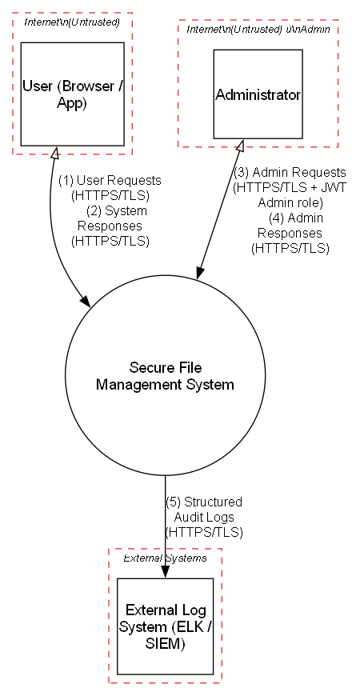
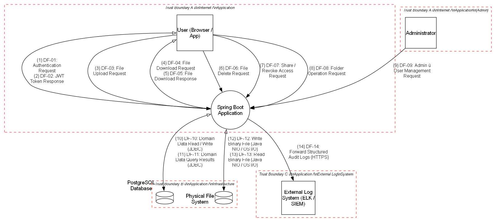
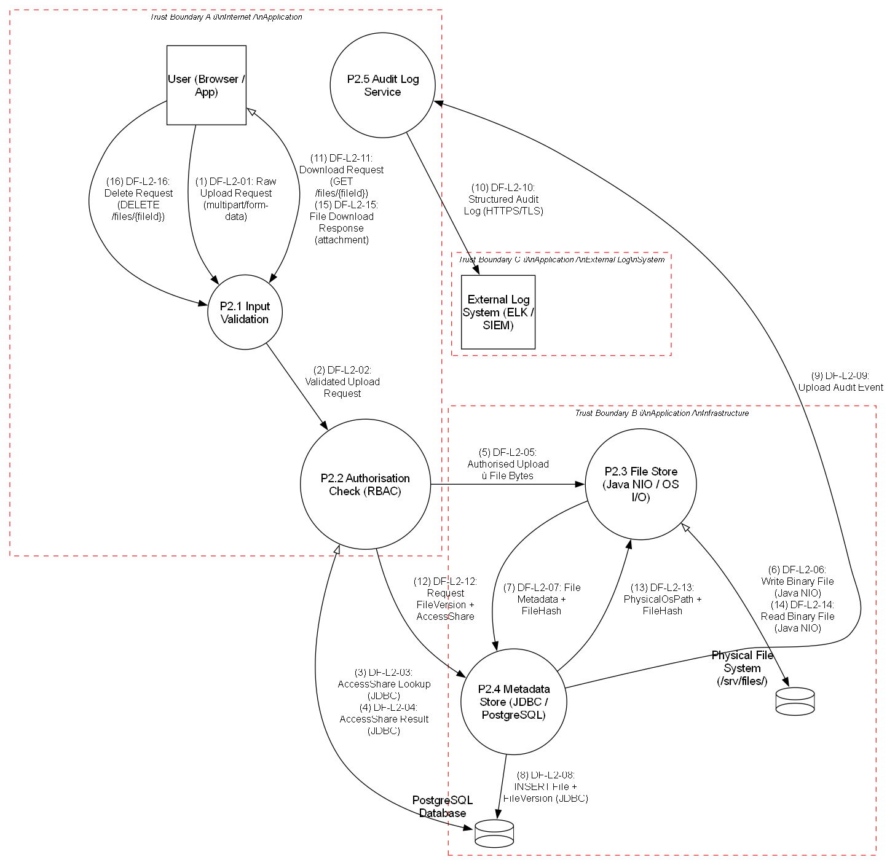

# Data Flow Diagrams — Ender Chest

**Course:** DESOFS 2026  
**Group:** WED\_NAP\_3  
**Project:** Ender Chest — Secure File Management System  
**Phase:** 1  
**Last updated:** 2026-04-20

---

## Overview

DFDs were produced using [pytm](https://github.com/OWASP/pytm) (source files in [DFD/](./DFD/)). Three levels of decomposition are provided, each justified by the complexity of the system.

**DFD Notation:**

| Symbol | Meaning |
|--------|---------|
| Rectangle | External Entity (Actor) |
| Circle / Ellipse | Process |
| Two parallel lines | Data Store |
| Dashed line | Trust Boundary |
| Arrow | Data Flow |

---

## DFD Level 0 — Context Diagram

> Source: [DFD/DFD lvl0.py](./DFD/DFD%20lvl0.py)

The Level 0 diagram treats the entire system as a **single black-box process**. Only external entities and top-level data flows are shown. No internal decomposition occurs at this level.

---

### External Entities

| Entity | Description | Trust Boundary |
|--------|-------------|----------------|
| **User (Browser / App)** | An end user interacting with the system via a browser or mobile REST client over HTTPS. May hold role OWNER, EDITOR, or VIEWER on a given resource. Subject to StorageQuota and IsLocked account lockout. | Internet (Untrusted) |
| **Administrator** | A privileged user who manages user accounts and system configuration via administrative endpoints. Authenticated by JWT with Admin role. | Internet (Untrusted) — Admin |
| **External Log System (ELK / SIEM)** | External log aggregation system receiving structured JSON audit events from the application in real time. Write-only, authenticated via API key over HTTPS/TLS. Provides immutable audit trail for non-repudiation. | External Systems |

---

### Process

| Process | Description |
|---------|-------------|
| **Secure File Management System** | The complete system as a black box. Internally: Spring Boot monolith handling authentication (JWT), file and folder operations (Java NIO / OS I/O), RBAC via AccessShare, persistence in PostgreSQL (JDBC), and structured audit logging. Decomposed in Level 1 DFD. |

---

### Trust Boundaries (Level 0)

| Boundary | Meaning |
|----------|---------|
| **Internet (Untrusted)** | Where Users and Administrators originate. All inbound traffic must use HTTPS/TLS and carry a valid JWT. |
| **Internet (Untrusted) — Admin** | Same logical zone as Internet (Untrusted), kept separate to make Administrator traffic explicitly visible as untrusted internet traffic subject to the same JWT auth and TLS requirements. |
| **External Systems** | Where third-party systems receiving outbound data live. Audit logs cross here over HTTPS/TLS with API key. |

---

### Data Flows (Level 0)

| ID | Source → Destination | Protocol | Description |
|----|---------------------|----------|-------------|
| **DF-L0-01** | User → System | HTTPS/TLS 1.3 | All user requests (authentication: login, register, refresh; file operations: upload, download, delete; folder operations: create, list, rename, delete; access management: share, revoke). All carry JWT in Authorization header except login and register. |
| **DF-L0-02** | System → User | HTTPS/TLS 1.3 | Responses: JWT tokens (on successful authentication), file content (Content-Disposition: attachment), JSON metadata responses, generic error messages. |
| **DF-L0-03** | Administrator → System | HTTPS/TLS 1.3 | Administrative requests: user account management (create, suspend, delete). Requires JWT with Admin role. |
| **DF-L0-04** | System → Administrator | HTTPS/TLS 1.3 | Administrative responses: confirmation of account operations, user listings, system status. |
| **DF-L0-05** | System → External Log System | HTTPS/TLS 1.3 | Structured JSON audit log events forwarded in real time. Each event: timestamp, userId, action, resourceId, resourceType, sourceIP. Authenticated via API key. Logs not stored exclusively on local server. |

---

## DFD Level 1 — System Decomposition

> Source: [DFD/DFD lvl1.py](./DFD/DFD%20lvl1.py)

Level 1 decomposes the black-box into its internal process, data stores, and all named data flows.

---

### External Entities (Level 1)

| Entity | Description | Trust Boundary |
|--------|-------------|----------------|
| **User (Browser / App)** | End user interacting via browser or REST client. May hold OWNER, EDITOR, or VIEWER role via AccessShare. Subject to StorageQuota enforcement and IsLocked account lockout. | Trust Boundary A — Internet / Application |
| **Administrator** | Privileged user managing accounts (create, suspend, delete) via administrative endpoints. Authenticated by JWT with Admin role. | Trust Boundary A — Internet / Application (Admin) |
| **External Log System (ELK / SIEM)** | External log aggregation system; write-only, authenticated via API key over HTTPS/TLS. Provides immutable audit trail for non-repudiation. | Trust Boundary C — Application / External Log System |

---

### Process (Level 1)

| Process | Description |
|---------|-------------|
| **Spring Boot Application** | Single Spring Boot monolith exposing a REST API over HTTPS/TLS. Handles: **(1)** Authentication — JWT issuance (15-min access token + refresh token), BCrypt/Argon2 password hashing, rate limiting, account lockout (IsLocked); **(2)** File operations — upload (magic-byte validation, UUID rename, StorageQuota check), download (Content-Disposition: attachment), soft delete (IsDeleted), FileHash integrity verification; **(3)** Folder operations — create/rename/delete via Java NIO (OS I/O), path normalisation to prevent path traversal; **(4)** Access control — AccessShare evaluated before every OS-level I/O; RBAC: OWNER / EDITOR / VIEWER; **(5)** Audit logging — structured JSON events forwarded to ELK/SIEM. |

---

### Data Stores (Level 1)

| Store | Description | Trust Boundary |
|-------|-------------|----------------|
| **PostgreSQL Database** | Relational store for all domain aggregates: User (UserId, Username, Email, PasswordHash, StorageQuota, IsLocked), File (FileId, FileName, FolderId, OwnerId, IsDeleted), FileVersion (VersionId, FileId, PhysicalOsPath, Size, MimeType, FileHash, UploadedAt), Folder (FolderId, FolderName, OwnerId, ParentFolderId), AccessShare (ShareId, ResourceId, ResourceType, GrantedToUserId, RoleType). Accessed exclusively via JDBC prepared statements / JPA named queries. Production DB user has DML-only permissions (no DDL, no TRUNCATE). | Trust Boundary B — Application / Infrastructure |
| **Physical File System** | Server filesystem directory outside the web root. Stores binary files referenced by PhysicalOsPath from FileVersion. Files are named using generated UUIDs — the original user-supplied filename is never used as a path component. Directory has no execute permissions. Accessed by Spring Boot via Java NIO. Only the application process OS user may read/write this directory. | Trust Boundary B — Application / Infrastructure |

---

### Trust Boundaries (Level 1)

| Boundary | Separates | Key Controls Enforced |
|----------|-----------|-----------------------|
| **A — Internet / Application** | Untrusted actors (User, Administrator) from the Spring Boot process | HTTPS/TLS 1.3, JWT authentication, input validation, path normalisation, magic-byte file check |
| **A (Admin) — Internet / Application (Admin)** | Administrator from the Spring Boot process | Same as Boundary A; separate object to make admin traffic explicitly visible as untrusted internet traffic subject to JWT auth |
| **B — Application / Infrastructure** | Spring Boot from data stores (PostgreSQL + File System) | JDBC prepared statements (no string concatenation), Java NIO path normalisation, DML-only DB user, storage directory outside web root |
| **C — Application / External Log System** | Spring Boot from ELK/SIEM | HTTPS/TLS 1.3, API key authentication on outbound audit log forwarding |

---

### Data Flows (Level 1)

| ID | Source → Destination | Protocol | Description |
|----|---------------------|----------|-------------|
| **DF-01** | User → Spring Boot App | HTTPS/TLS 1.3 | Authentication: POST /auth/register, /auth/login, /auth/refresh. Rate limited. Account locked (IsLocked=true) after N consecutive failures. |
| **DF-02** | Spring Boot App → User | HTTPS/TLS 1.3 | JWT access token (15 min expiry) + refresh token. Transmitted only over HTTPS/TLS. |
| **DF-03** | User → Spring Boot App | HTTPS/TLS 1.3 | File upload: POST /files/upload (multipart). JWT in header. Application validates: JWT, AccessShare role (OWNER or EDITOR), file type via magic bytes (ignores Content-Type header), file size vs StorageQuota. Stores binary with UUID name on filesystem and metadata in DB (File + FileVersion including FileHash). |
| **DF-04** | User → Spring Boot App | HTTPS/TLS 1.3 | File download: GET /files/{fileId}. JWT in header. Application checks AccessShare before reading PhysicalOsPath from FileVersion and streaming the file. |
| **DF-05** | Spring Boot App → User | HTTPS/TLS 1.3 | File binary content streamed with Content-Disposition: attachment. Never served via a direct static URL — always proxied through the application so RBAC is enforced. |
| **DF-06** | User → Spring Boot App | HTTPS/TLS 1.3 | File delete: DELETE /files/{fileId}. OWNER-only (HTTP 403 for EDITOR/VIEWER). Soft delete: UPDATE IsDeleted=true on File aggregate. Physical file not immediately removed. |
| **DF-07** | User → Spring Boot App | HTTPS/TLS 1.3 | Share/revoke: POST /resources/{resourceId}/share or DELETE /resources/{resourceId}/share. Creates or removes AccessShare record. OWNER-only. ResourceType determines FILE or FOLDER. |
| **DF-08** | User → Spring Boot App | HTTPS/TLS 1.3 | Folder operations: POST/GET/PUT/DELETE /folders/{folderId}. Application normalises paths via Java NIO to prevent path traversal. AccessShare checked before any OS-level directory operation. |
| **DF-09** | Administrator → Spring Boot App | HTTPS/TLS 1.3 | User management: GET/POST/DELETE /admin/users. Requires JWT with Admin role. Spring Boot Actuator restricted to internal network only in production. |
| **DF-10** | Spring Boot App → PostgreSQL | JDBC / TLS 1.2 | All domain read/write via JDBC prepared statements / JPA named queries — never raw string concatenation. Includes: User credentials (PasswordHash), File & FileVersion metadata (FileHash, PhysicalOsPath), Folder structure, AccessShare RBAC records. DML-only DB user. |
| **DF-11** | PostgreSQL → Spring Boot App | JDBC / TLS 1.2 | Query results: user records, file/folder metadata, FileVersion entries (including PhysicalOsPath for OS I/O and FileHash for integrity), AccessShare records for RBAC enforcement. |
| **DF-12** | Spring Boot App → Physical File System | Java NIO (OS I/O) | Write binary file to /srv/files/{uuid} via Java NIO. UUID filename (PhysicalOsPath) generated by the application — user-supplied filename never used as path component. Path normalised and validated against base directory before write. |
| **DF-13** | Physical File System → Spring Boot App | Java NIO (OS I/O) | Read binary file from /srv/files/{uuid} via Java NIO. Path normalised and validated. SHA-256 FileHash integrity check: recomputed hash compared to stored FileVersion.FileHash — aborts and logs DOWNLOAD_INTEGRITY_FAIL if mismatch. |
| **DF-14** | Spring Boot App → External Log System | HTTPS/TLS 1.3 | Structured JSON audit events forwarded in real time. Event fields: timestamp, userId, action, resourceId, resourceType, sourceIP. Authenticated via API key. Logs NOT stored exclusively locally — external system provides the immutable audit trail (non-repudiation). |

---

## DFD Level 2 — File Service Decomposition

> Source: [DFD/DFD lvl2.py](./DFD/DFD%20lvl2.py)

Level 2 decomposes the **File Service sub-system** — the highest threat-density area — into four internal logical sub-processes. This level directly maps to the critical threats identified in the STRIDE analysis and justifies the security design of the upload, download, and delete flows.

---

### External Entities (Level 2)

| Entity | Description | Trust Boundary |
|--------|-------------|----------------|
| **User (Browser / App)** | Authenticated end user. Carries a JWT in Authorization: Bearer header. May hold OWNER, EDITOR, or VIEWER role via AccessShare. All input is untrusted until validated and authorised by P2.1. | Trust Boundary A — Internet / Application |
| **External Log System (ELK / SIEM)** | Receives structured JSON audit events from P2.4. Write-only, authenticated via API key over HTTPS/TLS. Provides the immutable audit trail required for non-repudiation (mitigates T-13). | Trust Boundary C — Application / External Log System |

---

### Sub-Processes (Level 2)

| Sub-Process | Trust Boundary | Description |
|-------------|---------------|-------------|
| **P2.1 — File Request Handler** | A — Internet / Application | Single entry point for all incoming file requests. Combines input validation and authorisation before any I/O occurs. **Input validation:** (1) Filename sanitisation — strip directory separators (`../`, `/`, `\`), null bytes, and control characters; (2) Path normalisation — resolve with `java.nio.file.Path.normalize()`, verify inside base directory (prevents T-05 Path Traversal); (3) MIME-type validation — read magic bytes via Apache Tika, never trusts Content-Type header (prevents T-06 Web Shell); (4) File size check — reject before buffering (mitigates T-08 DoS); (5) Rate limiting — HTTP 429 per user if threshold exceeded (SDR-10). **Authorisation:** (6) JWT validation — verify signature, algorithm whitelist (HS256/RS256 only, reject `alg: none`), expiry, issuer claims (SDR-01, SDR-NEW-01); (7) AccessShare lookup — query PostgreSQL to determine caller's RoleType for the specific resourceId (prevents T-07 IDOR); (8) RBAC matrix enforcement — DELETE is OWNER-only; upload requires OWNER or EDITOR (prevents T-09 role abuse); (9) Object-level check — confirms caller has AccessShare record for the specific resourceId, not just that they are authenticated. **If any check fails: HTTP 403/429 returned immediately — no I/O occurs and no internal details disclosed.** |
| **P2.2 — File Store (Java NIO)** | B — Application / Infrastructure | Handles binary file I/O on the Physical File System via Java NIO. **Upload:** (1) Generates UUID for PhysicalOsPath — user-supplied filename never used as path component; (2) Resolves full path (basedir + UUID), normalises and verifies inside basedir; (3) Writes file bytes via `Files.write()`; (4) Computes SHA-256 FileHash of written bytes (passed to P2.3 for storage). **Download:** (1) Retrieves PhysicalOsPath from P2.3; (2) Normalises and validates path; (3) Reads file bytes via `Files.readAllBytes()`; (4) Verifies SHA-256 against stored FileVersion.FileHash — aborts with integrity alert and HTTP 500 if mismatch, DOWNLOAD_INTEGRITY_FAIL event emitted (SDR-NEW-11, mitigates T-17). **Delete:** No physical I/O — soft delete only via P2.3. |
| **P2.3 — Metadata Store (JDBC)** | B — Application / Infrastructure | Persists and queries File and FileVersion aggregates in PostgreSQL using prepared statements / JPA named queries only — string concatenation in SQL is prohibited (prevents T-11). **Upload:** INSERT File + FileVersion including FileHash, PhysicalOsPath, IsDeleted=false. **Download:** SELECT FileVersion to retrieve PhysicalOsPath and FileHash. **Delete:** UPDATE files SET IsDeleted=true (soft delete). **StorageQuota check:** SUM(size) for OwnerId — reject with HTTP 429 if quota exceeded (SDR-NEW-07). **AccessShare lookup (for P2.1):** SELECT role_type FROM access_share WHERE resource_id=? AND granted_to_user_id=?. DB user has DML-only permissions — no DDL, no TRUNCATE (SDR-NEW-06). |
| **P2.4 — Audit Log Service** | A — Internet / Application | Emits a structured JSON audit event for every File Service operation **before** the response is returned to the caller. **Event fields:** timestamp (ISO-8601 UTC), userId, action (UPLOAD \| DOWNLOAD \| DELETE \| DOWNLOAD\_INTEGRITY\_FAIL), resourceId (FileId), resourceType (FILE), sourceIP, outcome (SUCCESS \| FAILURE), failureReason (generic — no stack trace). Forwards events to External Log System over HTTPS/TLS with API key (SDR-NEW-03). Logs NOT stored exclusively on local server. Sensitive data (passwords, tokens, file content) NEVER logged (SDR-NEW-12). |

---

### Data Stores (Level 2)

| Store | Description | Trust Boundary |
|-------|-------------|----------------|
| **PostgreSQL Database** | Stores File, FileVersion, and AccessShare aggregates. Key fields for the File Service: FileVersion (VersionId, FileId, PhysicalOsPath [UUID], Size, MimeType, FileHash [SHA-256], UploadedAt); AccessShare (ShareId, ResourceId, ResourceType, GrantedToUserId, RoleType). Accessed via JDBC prepared statements only. DML-only DB user. | B — Application / Infrastructure |
| **Physical File System (/srv/files/)** | Server filesystem directory outside the web root. Binary files named with system-generated UUIDs. No execute permissions on directory or contents. Accessed by P2.2 via Java NIO. Physical removal only by a scheduled cleanup process after IsDeleted=true confirmed. | B — Application / Infrastructure |

---

### Trust Boundaries (Level 2)

| Boundary | Separates | Key Controls Enforced |
|----------|-----------|-----------------------|
| **A — Internet / Application** | Untrusted User from P2.1 File Request Handler | HTTPS/TLS 1.3, JWT validation, input validation, MIME magic-byte check, path normalisation, AccessShare/RBAC check |
| **B — Application / Infrastructure** | P2.2 and P2.3 (JVM) from PostgreSQL and Physical File System | JDBC prepared statements, Java NIO path normalisation + base-dir check, DML-only DB user, storage outside web root |
| **C — Application / External Log System** | P2.4 Audit Log Service from ELK/SIEM | HTTPS/TLS 1.3, API key authentication, outbound log forwarding |

---

### Data Flows — Upload (Level 2)

| ID | Source → Destination | Protocol | Description |
|----|---------------------|----------|-------------|
| **DF-L2-01** | User → P2.1 | HTTPS/TLS 1.3 | POST /files/upload — multipart/form-data containing: file binary content, original filename, target folderId. JWT in Authorization: Bearer header. All data untrusted at this point. |
| **DF-L2-02** | P2.1 → PostgreSQL | JDBC / TLS 1.2 | AccessShare lookup (SELECT role_type FROM access_share WHERE resource_id=? AND granted_to_user_id=? AND resource_type='FOLDER') + StorageQuota check (SELECT SUM(fv.size) … WHERE f.owner_id=?). Both use prepared statements. |
| **DF-L2-03** | PostgreSQL → P2.1 | JDBC / TLS 1.2 | RoleType + quota result returned. If VIEWER or no record: P2.1 rejects HTTP 403. If quota exceeded: P2.1 rejects HTTP 429. If both pass: validated request forwarded to P2.2. |
| **DF-L2-04** | P2.1 → P2.2 | Internal (Spring Boot JVM) | Validated file bytes + sanitised metadata (filename, folderId, OwnerId, validated MimeType, size) forwarded for physical storage. A new UUID is generated for PhysicalOsPath. |
| **DF-L2-05** | P2.2 → Physical File System | Java NIO (OS I/O) | Write file bytes to /srv/files/{uuid} via Java NIO. UUID filename generated by the application. Path normalised and verified inside basedir. SHA-256(file bytes) → FileHash computed after write. |
| **DF-L2-06** | P2.2 → P2.3 | Internal (Spring Boot JVM) | File metadata passed to P2.3 for persistence: FileId (UUID), FileName (sanitised display name), FolderId, OwnerId, MimeType, Size, PhysicalOsPath (UUID on disk), FileHash (SHA-256), UploadedAt, IsDeleted=false. |
| **DF-L2-07** | P2.3 → PostgreSQL | JDBC / TLS 1.2 | INSERT INTO files + file_versions using prepared statements (never string concatenation). Prevents T-11 SQL Injection. |
| **DF-L2-08** | P2.3 → P2.4 | Internal (Spring Boot JVM) | Trigger UPLOAD audit event before returning response: `{ action: 'UPLOAD', userId, resourceId: FileId, resourceType: 'FILE', sourceIP, outcome: 'SUCCESS', timestamp }`. |
| **DF-L2-09** | P2.4 → External Log System | HTTPS/TLS 1.3 | JSON audit event forwarded over HTTPS/TLS with API key. Crosses Trust Boundary C — key enforcement point for log immutability and non-repudiation (mitigates T-13). |

---

### Data Flows — Download (Level 2)

| ID | Source → Destination | Protocol | Description |
|----|---------------------|----------|-------------|
| **DF-L2-10** | User → P2.1 | HTTPS/TLS 1.3 | GET /files/{fileId} — JWT in Authorization: Bearer header. P2.1 validates fileId format, JWT (alg whitelist, exp, iss, sub), and confirms caller holds at least VIEWER role for this fileId via AccessShare (object-level authorisation — prevents T-07 IDOR). |
| **DF-L2-11** | P2.1 → P2.3 | Internal (Spring Boot JVM) | Request FileVersion record for the given fileId to obtain PhysicalOsPath and FileHash needed for the physical file read and integrity verification. |
| **DF-L2-12** | P2.3 → P2.2 | Internal (Spring Boot JVM) | P2.3 returns PhysicalOsPath (UUID filename on disk) and stored FileHash (SHA-256) from the FileVersion record. P2.2 uses PhysicalOsPath to locate the file and FileHash to verify integrity after reading. |
| **DF-L2-13** | Physical File System → P2.2 | Java NIO (OS I/O) | P2.2 reads binary file from /srv/files/{uuid} via Java NIO. Path normalised and validated before read. SHA-256(read bytes) computed and compared to stored FileHash. If mismatch: integrity alert raised, P2.4 logs DOWNLOAD\_INTEGRITY\_FAIL, HTTP 500 returned — tampered file NOT served (SDR-NEW-11, mitigates T-17). |
| **DF-L2-14** | P2.2 → User | HTTPS/TLS 1.3 | Integrity-verified file bytes streamed to user. Headers: Content-Disposition: attachment; filename="{sanitised\_original\_name}", Content-Type: {validated\_mime\_type}, X-Content-Type-Options: nosniff. Never served as a direct static URL. |

---

### Data Flows — Delete (Level 2)

| ID | Source → Destination | Protocol | Description |
|----|---------------------|----------|-------------|
| **DF-L2-15** | User → P2.1 | HTTPS/TLS 1.3 | DELETE /files/{fileId} — JWT in Authorization: Bearer header. P2.1 validates JWT and enforces OWNER-only constraint (HTTP 403 for EDITOR/VIEWER, mitigates T-09). P2.1 instructs P2.3 to soft delete: UPDATE files SET IsDeleted=true WHERE FileId=?. Physical file removal handled by a separate scheduled cleanup process. |

---

### Threat Mapping to Level 2 Sub-Processes

| Sub-Process | Threats Addressed |
|-------------|------------------|
| **P2.1 — File Request Handler** | T-05 Path Traversal, T-06 Web Shell Upload, T-07 IDOR, T-08 DoS by Upload, T-09 Role Abuse |
| **P2.2 — File Store** | T-05 Path Traversal (base-dir escape on I/O), T-17 File Integrity Tampering |
| **P2.3 — Metadata Store** | T-11 SQL Injection |
| **P2.4 — Audit Log Service** | T-13 Repudiation / Log Tampering |

---

## DFD Element Completeness Checklist

| Element Type | Level 0 | Level 1 | Level 2 |
|---|---|---|---|
| External entities | User, Administrator, ELK/SIEM | User, Administrator, ELK/SIEM | User, ELK/SIEM |
| Processes | Secure File Mgmt System (black box) | Spring Boot Application | P2.1, P2.2, P2.3, P2.4 |
| Data stores | — | PostgreSQL, Physical File System | PostgreSQL, Physical File System |
| Trust boundaries | Internet (Untrusted), Internet (Admin), External Systems | A (Internet/App), A-Admin, B (App/Infra), C (App/Log) | A (Internet/App), B (App/Infra), C (App/Log) |
| Data flows | DF-L0-01 … DF-L0-05 (5 flows) | DF-01 … DF-14 (14 flows) | DF-L2-01 … DF-L2-15 (15 flows) |
