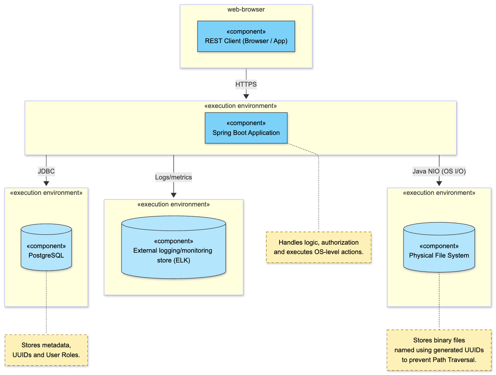
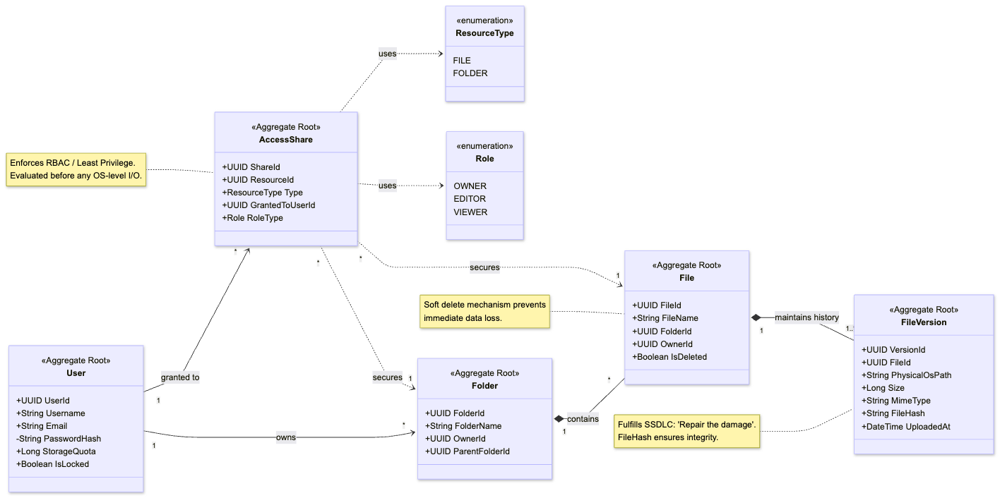

# System Overview

## 1. Purpose and Scope
Ender Chest is a secure file management system that allows users to upload, download, organize, and share files and folders through a REST API. The system must execute OS-level actions (directory creation and file I/O) triggered by user requests, therefore secure design and authorization boundaries are central to the architecture.

## 2. Physical Architecture (Deployment View)
This diagram shows the physical deployment: a REST client communicating with a Spring Boot backend over HTTPS. The backend persists metadata and access control information in PostgreSQL and stores binary content on the host file system. OS-level actions are executed by the backend using Java NIO.

## 3. Domain Model (DDD View)
The domain model is organized around DDD aggregates. Authorization (RBAC / least privilege) and damage-reduction mechanisms (soft delete and file versioning/rollback) are represented explicitly in the model.

## 4. Key Security and Design Notes
- **Separation of responsibilities:** the database stores metadata (users, permissions, file/folder records), while the OS file system stores binary file contents.
- **Authorization first:** access checks are performed before any OS-level file operation.
- **Path traversal prevention by design:** physical storage paths are derived from safe identifiers (e.g., UUIDs) and restricted to a configured base directory.
- **Damage reduction:** soft delete and file version history reduce the impact of accidental or malicious destructive actions.