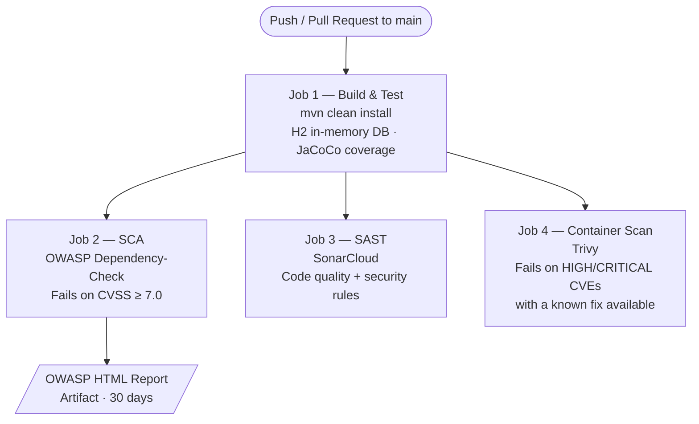

# Pipeline Architecture — Decision Record

**Developer 1 — The Pipeline Architect**
**Phase 2, Sprint 1 | DESOFS 2026**

---

## 1. Scope

This document records the technical decisions made when designing and implementing the CI/CD pipeline for EnderChest. It covers job structure, tool selection, threshold choices, and configuration rationale so that the decisions can be evaluated and revisited in future sprints.

Files created or modified as part of this work:

| File | Purpose |
|---|---|
| `.github/workflows/ci.yml` | The pipeline definition |
| `pom.xml` | OWASP DC, JaCoCo, and SonarCloud Maven configuration |
| `owasp-suppressions.xml` | Documented false-positive suppressions for OWASP DC |

---

## 2. Pipeline Structure

### 2.1 Job Dependency Graph

Jobs 2, 3, and 4 run in parallel after Job 1 passes. This keeps total pipeline time low while ensuring that no security scan runs against code that does not compile or has failing tests.

    build --> sca
    build --> sonar
    build --> trivy

    sca["Job 2 — SCA\nOWASP Dependency-Check\nFails on CVSS ≥ 7.0"]
    sonar["Job 3 — SAST\nSonarCloud\nCode quality + security rules"]
    trivy["Job 4 — Container Scan\nTrivy\nFails on HIGH/CRITICAL CVEs\nwith a known fix available"]

The pipeline triggers on every push and every pull request targeting `main`. This enforces all security gates at PR time, before any code reaches the main branch.

### 2.3 Test Database

Tests use an H2 in-memory database configured in `src/test/resources/application-test.properties`, so no PostgreSQL service container is needed in CI. The JWT JWK set URI is overridden with a local placeholder — tests using `@WithMockUser` never contact the Auth0 IdP, keeping the pipeline free of external runtime dependencies.

---

## 3. Software Composition Analysis (SCA) — OWASP Dependency-Check

### 3.1 What It Does

OWASP Dependency-Check (OWASP DC) scans every JAR in the project and cross-references each one against the **NVD (National Vulnerability Database)** — the US government's (NIST) authoritative public database of known software vulnerabilities. Each entry in the NVD carries a **CVSS score** (Common Vulnerability Scoring System, 0–10) that rates severity. If a dependency matches a known CVE with a score above the configured threshold, the build fails.

### 3.2 Why OWASP DC Over Snyk

Snyk was considered as an alternative. OWASP DC was chosen because it is open source, requires no external SaaS account, and integrates directly with Maven. Snyk provides a better developer experience (inline PR comments) but requires a team account and a billing decision. OWASP DC can be replaced with Snyk in a future sprint if the team decides to.

### 3.3 CVSS Threshold: 7.0

`failBuildOnCVSS=7` was set to reject any dependency with a CVSS v3 base score of 7.0 or higher.

- CVSS 7.0 is the boundary between **Medium** (4.0–6.9) and **High** (7.0–8.9).
- All CRITICAL (9.0–10.0) and HIGH vulnerabilities block the build.
- Medium findings are reported but do not block — many are context-dependent and not exploitable in this application.
- This threshold aligns with SDR-07 from the Phase 1 requirements.

### 3.4 Suppression Policy

Some findings cannot be fixed because the vulnerable dependency is managed by the Spring Boot BOM and cannot be upgraded independently of Spring Boot itself. These are suppressed in `owasp-suppressions.xml` rather than by lowering the threshold.

Each suppression entry includes the exact CVE identifier, a written justification explaining why the attack vector is not reachable in EnderChest, a reviewer name and review date, and an annual review obligation. This ensures suppressions are deliberate and auditable rather than silent workarounds.

### 3.5 NVD Database Caching and API Key

Before OWASP DC can scan anything, it must download the entire NVD database to the CI runner — this is how it knows which CVEs exist. The database is several hundred megabytes.

Without an API key, NVD rate-limits unauthenticated requests to approximately one request every six seconds. At that rate, the full database download can take 30+ minutes per run or time out entirely. A free NVD API key was registered and stored as a GitHub Actions secret (`NVD_API_KEY`), which removes the throttle and brings the download down to a few minutes.

Additionally, a weekly GitHub Actions cache keyed on `year-weeknumber` was introduced so that runs within the same week reuse the already-downloaded database entirely, skipping the download step for most runs.

### 3.6 Report Artifact

The HTML report is uploaded as a GitHub Actions artifact retained for 30 days with `if: always()`, so the team can review which dependency caused a failure even when the build is red.

---

## 4. Static Application Security Testing (SAST) — SonarQube Cloud

### 4.1 Why SonarCloud in Addition to GitHub CodeQL

GitHub's built-in CodeQL runs automatically on every push via the repository's default code scanning setup and results appear in the **Security > Code scanning** tab. Running a duplicate CodeQL job in the workflow would analyse the same code twice for no benefit, so the explicit CodeQL workflow job was removed.

SonarCloud was added as a complementary SAST layer because it provides:
- Code quality metrics (code smells, maintainability, duplication) alongside security rules
- JaCoCo coverage integration — coverage data from the test run is uploaded with the analysis and displayed per file on the dashboard
- A dedicated project dashboard accessible to the whole team and evaluator at sonarcloud.io

### 4.2 Coverage Integration

The `sonar` job runs `mvn verify` before the analysis, which executes all tests and generates the JaCoCo XML report. SonarCloud picks this up automatically and shows per-file coverage on the project dashboard.

### 4.3 Quality Gate — Known Limitation

SonarCloud's default quality gate ("Sonar way") requires ≥ 80% coverage on new code. The current test suite does not reach this threshold, so the quality gate shows as failed in the SonarCloud dashboard. The pipeline job itself still passes because `-Dsonar.qualitygate.wait=true` is intentionally not set.

Adding that flag would make the pipeline correctly fail on quality gate violations, but doing so without a custom quality gate would permanently break the pipeline until coverage reaches 80%. The correct resolution — creating a custom quality gate with a threshold appropriate to this project's maturity and then enabling the flag — is tracked as a known gap for a future sprint.

---

## 5. Container Security Scan — Trivy

### 5.1 Why Trivy in Addition to OWASP DC

OWASP DC scans Maven JARs (the Java dependency layer). It cannot see OS-level packages inside the Docker image. The runtime image (`eclipse-temurin:21-jre-alpine`) ships Alpine Linux packages (`musl`, `openssl`, `busybox`, etc.) that may carry their own CVEs. Trivy fills this gap by scanning the built Docker image, providing complete CVE coverage across both the OS layer and the Java layer.

### 5.2 Configuration Choices

| Setting | Value | Rationale |
|---|---|---|
| `severity` | `CRITICAL,HIGH` | Matches the OWASP DC threshold (CVSS ≥ 7.0 = HIGH+) for a consistent policy across both tools |
| `ignore-unfixed` | `true` | Only fails on CVEs that have a released fix — mirrors the OWASP DC suppression policy of not blocking on issues that cannot be resolved |
| `exit-code` | `1` | Fails the pipeline job, blocking the merge |

When a HIGH/CRITICAL CVE with a fix is found in the base image, the resolution is to update the base image tag in the `Dockerfile` to a version that includes the fix. No separate suppression file is needed because `ignore-unfixed: true` already handles unfixable findings.

---

## 6. Branch Protection Rules

Branch protection was configured on the `main` branch in GitHub to enforce that all pipeline jobs pass before a pull request can be merged:

| Setting | Value |
|---|---|
| Require a pull request before merging | Enabled |
| Required approving reviews | 1 |
| Dismiss stale PR approvals when new commits are pushed | Enabled |
| Require status checks to pass before merging | Enabled |
| Required status checks | `Build & Test`, `SCA — OWASP Dependency-Check`, `SAST — SonarCloud`, `Container Scan — Trivy` |
| Require branches to be up to date before merging | Enabled |
| Do not allow bypassing the above settings | Enabled |

One required reviewer was chosen over two because the team has 4 developers on a strict sprint timeline. Requiring 2 reviewers would serialize work unnecessarily; 1 approval ensures a second pair of eyes without creating a bottleneck.

---

## 8. Trade-offs and Known Limitations

| Item | Trade-off |
|---|---|
| OWASP DC CVSS threshold 7.0 | Medium CVEs (4.0–6.9) do not block the build. A future sprint could tighten this to 6.0. |
| SonarCloud quality gate not enforced | `-Dsonar.qualitygate.wait=true` is not set because the default gate requires 80% coverage which the current test suite does not reach. Fix: create a custom quality gate with an appropriate threshold, then enable the flag. |
| SonarCloud free tier — main branch only | PR-level analysis (inline comments on pull requests) is a paid SonarCloud feature. Only the `main` branch is analysed on the free tier. |
| NVD cache refresh weekly | New CVEs published mid-week are not picked up until the cache expires. Critical zero-days would require manually invalidating the cache. |
| No DAST in pipeline | OWASP ZAP DAST was planned in Phase 1 (ST-01, ST-03, ST-06). It requires a running application instance and is deferred to a sprint where a staging environment exists. |
| Trivy — base image CVEs only | Trivy scans the OS layer in the Docker image. `ignore-unfixed: true` means unfixable Alpine CVEs are not blocking. When a fix is released, updating the base image tag in the `Dockerfile` resolves it. |
