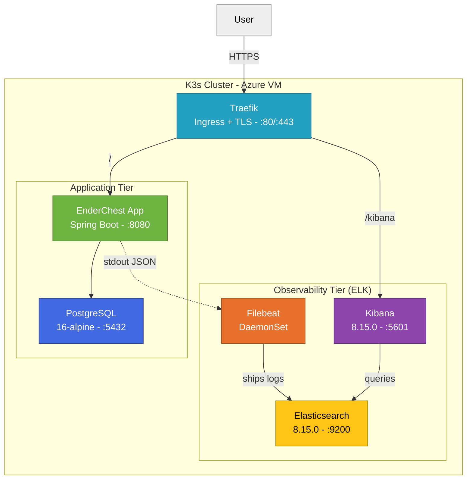
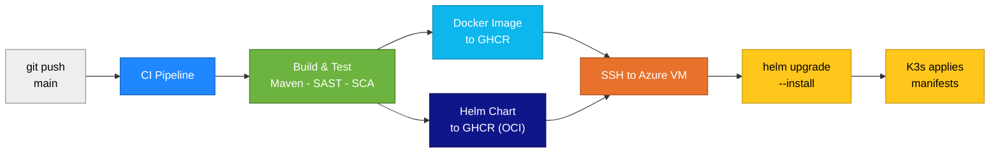
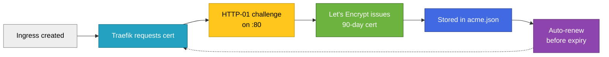
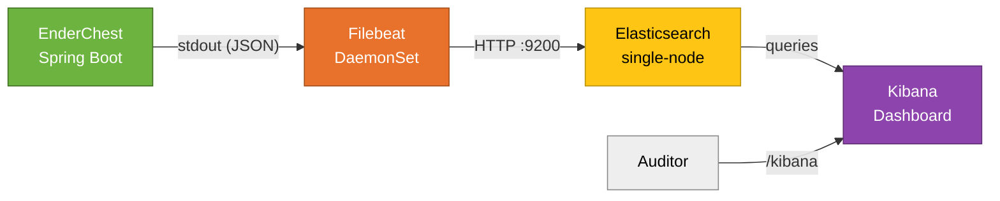

<div align="center">

# Phase 2 — Sprint 2
## Deployment Architecture & ELK Stack Report


---

### Tech Stack


</div>

---

## Table of Contents

1. [Introduction](#1-introduction)
2. [Infrastructure Overview](#2-infrastructure-overview)
3. [CI/CD Pipeline](#3-cicd-pipeline)
4. [TLS / HTTPS Configuration](#4-tls--https-configuration)
5. [Centralized Audit Logging (SDR-NEW-03)](#5-centralized-audit-logging-sdr-new-03)
6. [Health Monitoring](#6-health-monitoring)
7. [Networking & Ingress](#7-networking--ingress)
8. [Persistence](#8-persistence)
9. [Security Considerations](#9-security-considerations)
10. [Helm Chart Structure](#10-helm-chart-structure)
11. [Operational Procedures](#11-operational-procedures)
12. [Summary](#12-summary)

---

## 1. Introduction

### 1.1 Purpose

This report documents the **production deployment architecture** of the EnderChest application, including the Kubernetes infrastructure, CI/CD pipeline, TLS configuration, and the centralized audit logging system (ELK stack) implemented to satisfy security requirement **`SDR-NEW-03`** (Audit Logging & Monitoring).

### 1.2 Scope

The sprint delivered four primary work streams:

| # | Work Stream | Description |
|:-:|:------------|:------------|
| 1 | **Production Deployment** | Helm-based deployment to a K3s single-node cluster on Azure |
| 2 | **Centralized Audit Logging** | Elasticsearch + Kibana + Filebeat for structured log analysis |
| 3 | **TLS / HTTPS** | Automated Let's Encrypt certificates via Traefik's built-in ACME |
| 4 | **Health Monitoring** | Spring Boot Actuator for Kubernetes health probes |

---

## 2. Infrastructure Overview

### 2.1 Cluster Architecture

| Component | Details |
|:----------|:--------|
| **Cloud Provider** | Microsoft Azure |
| **Region** | Sweden Central |
| **VM Size** | Standard B2s (2 vCPUs, 4 GiB RAM) |
| **OS** | Ubuntu 22.04 LTS |
| **Kubernetes** | K3s (lightweight) — single-node |
| **Ingress Controller** | Traefik (bundled with K3s) |
| **Storage** | local-path-provisioner (PVCs) |
| **DNS** | `enderchest.swedencentral.cloudapp.azure.com` |

### 2.2 Deployed Components



### 2.3 Resource Allocation

| Pod | CPU Request | CPU Limit | Mem Request | Mem Limit |
|:----|:-----------:|:---------:|:-----------:|:---------:|
| EnderChest App | `250m` | `500m` | `256Mi` | `512Mi` |
| PostgreSQL | — | — | — | — |
| Elasticsearch | — | — | — | `1Gi` |
| Kibana | — | — | `512Mi` | `1Gi` |
| Filebeat | `100m` | `200m` | `128Mi` | `256Mi` |
| **Total** | | | **~1.7Gi** | **~3.5Gi** |

> [!WARNING]
> The 4 GiB VM runs at **~90 % memory limits**. There is no headroom for additional pods such as cert-manager — this directly informed the TLS design decision in §4.

---

## 3. CI/CD Pipeline

### 3.1 Deployment Flow



### 3.2 Pipeline Steps

| Step | Action | Tooling |
|:-----|:-------|:--------|
| **Build & Test** | Maven build, unit tests, SAST, SCA | SonarCloud · OWASP Dependency-Check |
| **Docker Image** | Multi-stage build → GHCR | `ghcr.io/mei-desofs/...` |
| **Helm Chart** | Lint, validate, package as OCI | helm · kubeconform |
| **Deploy** | SSH → pull chart → upgrade | helm upgrade --install |

### 3.3 Helm Validation

> [!NOTE]
> The CI pipeline validates the chart **before** deployment:
> - `helm lint --strict` — syntax and best practices
> - `kubeconform` — schema validation against Kubernetes API specs
> - Skipped CRDs: `HelmChartConfig` (K3s-specific, not in upstream schemas)

---

## 4. TLS / HTTPS Configuration

### 4.1 Approach

We use **Traefik's built-in ACME** (Let's Encrypt) rather than cert-manager to minimize resource consumption on the constrained 4 GiB VM.

| Approach | Extra Pods | Memory Overhead | Decision |
|:---------|:----------:|:---------------:|:--------:|
| cert-manager | 3 pods | ~300 MB | Rejected |
| **Traefik ACME** | **0 pods** | **0 MB** | **Chosen** |

### 4.2 Implementation

A `HelmChartConfig` resource configures the K3s-bundled Traefik:

```yaml
additionalArguments:
  - "--certificatesresolvers.letsencrypt.acme.email=<team-email>"
  - "--certificatesresolvers.letsencrypt.acme.storage=/data/acme.json"
  - "--certificatesresolvers.letsencrypt.acme.httpchallenge.entrypoint=web"
```

Ingress resources reference the resolver via annotation:

```yaml
traefik.ingress.kubernetes.io/router.tls.certresolver: letsencrypt
```

### 4.3 Certificate Lifecycle



---

## 5. Centralized Audit Logging (SDR-NEW-03)

### 5.1 Security Requirement

> [!IMPORTANT]
> **SDR-NEW-03:** The system shall maintain an immutable audit log of all security-relevant events including authentication, authorization decisions, file operations, and administrative actions.

### 5.2 Architecture



### 5.3 Structured Logging (Application Layer)

The application uses **`logstash-logback-encoder`** to emit structured JSON in production:

```xml
<!-- logback-spring.xml (prod profile) -->
<encoder class="net.logstash.logback.encoder.LogstashEncoder"/>
```

Example output:

```json
{
  "@timestamp": "2026-06-16T12:00:00.000Z",
  "level": "INFO",
  "logger_name": "pt.isep.desofs.enderchest.service.FileService",
  "message": "File uploaded successfully",
  "userId": "auth0|abc123",
  "fileId": "550e8400-e29b-41d4-a716-446655440000",
  "action": "FILE_UPLOAD"
}
```

### 5.4 Log Collection (Filebeat)

| Setting | Value |
|:--------|:------|
| Log path | `/var/log/containers/*enderchest*_default_enderchest-*.log` |
| Excluded | filebeat, elasticsearch, kibana, postgresql containers |
| JSON parsing | `keys_under_root: true` (fields promoted to top level) |
| Index pattern | `enderchest-app-YYYY.MM.DD` (daily rotation) |
| Data streams | **Disabled** (`data_stream.enabled: false`) |
| ILM | Disabled |

> [!CAUTION]
> Filebeat 8.x defaults to **data streams**, which enforce strict ECS mappings and reject app-specific JSON fields with `status=400`. Setting `data_stream.enabled: false` and `setup.template.enabled: false` forces plain indices with dynamic mapping — this was the key fix that got logs flowing.

### 5.5 Storage & Retention (Elasticsearch)

| Setting | Value |
|:--------|:------|
| Deployment | Single-node (`discovery.type: single-node`) |
| Persistence | 5 Gi PVC (local-path-provisioner) |
| Index pattern | `enderchest-app-*` |
| Heap | Default (512 MB) |

### 5.6 Visualization (Kibana)

| Setting | Value |
|:--------|:------|
| Access URL | `https://enderchest.swedencentral.cloudapp.azure.com/kibana` |
| Base path | `/kibana` (`SERVER_BASEPATH`) |
| Memory | 1 Gi limit (`NODE_OPTIONS=--max-old-space-size=768`) |
| Data View | `enderchest-app-*` with `@timestamp` field |

### 5.7 Kibana Setup

> [!TIP]
> After deployment, create a Data View:
> 1. **Stack Management → Data Views**
> 2. Create new: index pattern `enderchest-app-*`, timestamp field `@timestamp`
> 3. Go to **Discover** to browse application logs

---

## 6. Health Monitoring

### 6.1 Spring Boot Actuator

| Endpoint | Auth | Purpose |
|:---------|:----:|:--------|
| `/actuator/health` | Public | Kubernetes probes |

Restricted exposure in `application.properties`:

```properties
management.endpoints.web.exposure.include=health
management.endpoint.health.show-details=always
```

### 6.2 Kubernetes Probes

| Probe | Type | Path | Interval | Purpose |
|:------|:-----|:-----|:--------:|:--------|
| **Startup** | HTTP GET | `/actuator/health` | 5s ×12 (30s delay) | Wait for Spring Boot init |
| **Liveness** | HTTP GET | `/actuator/health` | 30s | Restart if deadlocked |
| **Readiness** | HTTP GET | `/actuator/health` | 15s | Remove from Service if unhealthy |

> [!NOTE]
> The startup probe grants the app up to **90 seconds** to boot (30s initial + 12 × 5s), accommodating JPA schema initialization and Auth0 key discovery — without the liveness probe prematurely killing the pod.

---

## 7. Networking & Ingress

### 7.1 Ingress Rules

| Path | Backend | Port | TLS |
|:-----|:--------|:----:|:---:|
| `/` | EnderChest App | `8080` | Let's Encrypt |
| `/kibana` | Kibana | `5601` | Let's Encrypt |

### 7.2 Internal Services

| Service | Type | Port | Access |
|:--------|:-----|:----:|:-------|
| enderchest-app | ClusterIP | `8080` | Via Ingress |
| postgresql | ClusterIP | `5432` | Internal only |
| elasticsearch | ClusterIP | `9200` | Internal only |
| kibana | ClusterIP | `5601` | Via Ingress (`/kibana`) |

---

## 8. Persistence

| Component | PVC Size | Mount Path | Purpose |
|:----------|:--------:|:-----------|:--------|
| PostgreSQL | `10Gi` | `/var/lib/postgresql/data` | Database storage |
| Elasticsearch | `5Gi` | `/usr/share/elasticsearch/data` | Log indices |
| EnderChest App | `10Gi` | `/data/files` | User file storage |

> [!NOTE]
> All PVCs use the K3s `local-path-provisioner`, which provisions storage on the node's local disk.

---

## 9. Security Considerations

### 9.1 Network Security

- **Azure NSG** restricts inbound traffic to ports `80` (HTTP/ACME) and `443` (HTTPS)
- **Internal services** (PostgreSQL, Elasticsearch) are ClusterIP — not externally exposed
- **TLS termination** at Traefik ingress — all external traffic encrypted

### 9.2 Image Security

- Application image pulled from **private** GHCR registry (requires `ghcr-secret`)
- Infrastructure images from **official** Docker Hub repositories
- No Bitnami dependencies — official images used for reliability

### 9.3 Secrets Management

| Secret | Purpose | Storage |
|:-------|:--------|:--------|
| `ghcr-secret` | Pull private container images | Kubernetes Secret |
| PostgreSQL password | DB authentication | Helm values (env var) |
| ACME certificate | TLS private key | Traefik pod filesystem |

### 9.4 Log Integrity

- Logs written to stdout — immutable once collected by Filebeat
- Elasticsearch indices are append-only during normal operation
- Daily index rotation provides natural segmentation for forensic analysis

---

## 10. Helm Chart Structure

```
helm-chart/
├── Chart.yaml                          # Chart metadata (v0.1.x)
├── values.yaml                         # All configurable values
└── templates/
    ├── deployment.yaml                 # App Deployment + probes
    ├── service.yaml                    # App ClusterIP Service
    ├── ingress.yaml                    # App Ingress (TLS)
    ├── postgresql.yaml                 # PostgreSQL StatefulSet + Service
    ├── traefik-config.yaml             # HelmChartConfig (ACME)
    └── elk/
        ├── elasticsearch.yaml          # ES Deployment + PVC + Service
        ├── kibana.yaml                 # Kibana Deployment + Service + Ingress
        └── filebeat.yaml               # Filebeat DaemonSet + ConfigMap + RBAC
```

---

## 11. Operational Procedures

### 11.1 Deploying

Deployment is fully automated via GitHub Actions on push to `main`. Manual deployment:

```bash
ssh azureuser@enderchest.swedencentral.cloudapp.azure.com
helm upgrade --install ender-chest \
  oci://ghcr.io/mei-desofs/desofs2026-wed_nap_3/charts/enderchest \
  --version <version> --wait --timeout 30m
```

### 11.2 Viewing Logs

```bash
# Live app logs
kubectl logs -l app.kubernetes.io/name=enderchest -f

# Via Kibana -> Discover
# https://enderchest.swedencentral.cloudapp.azure.com/kibana
```

### 11.3 Troubleshooting

```bash
# Check pod status
kubectl get pods

# Check resource usage
kubectl describe node | grep -A 5 "Allocated resources"

# Check Filebeat is shipping logs
kubectl logs -l app=filebeat --tail=20

# Check Elasticsearch indices
kubectl exec -it $(kubectl get pod -l app=elasticsearch -o jsonpath='{.items[0].metadata.name}') \
  -- curl -s localhost:9200/_cat/indices
```

---

## 12. Summary

The deployment architecture provides a **production-ready environment** for EnderChest with:

- **Automated CI/CD** — push-to-deploy with Helm chart validation
- **TLS encryption** — zero-overhead Let's Encrypt via Traefik ACME
- **Centralized audit logging** — satisfying SDR-NEW-03 with the ELK stack
- **Health monitoring** — Spring Boot Actuator with a proper Kubernetes probe strategy
- **Resource efficiency** — all components fit within a 4 GiB Azure VM

> [!IMPORTANT]
> All infrastructure is defined **as code** (Helm templates) and versioned alongside the application, ensuring reproducible and auditable deployments.

---

<div align="center">

**DESOFS 2026 · Group WED_NAP_3 · Phase 2 — Sprint 2**

</div>
