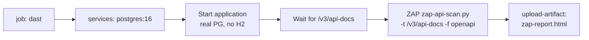

# Phase 2 — Sprint 2: Deliverables Index & Report

**DESOFS 2026 | WED_NAP_3 | June 2026**

---

## Documentation

- **[DEPLOYMENT_REPORT.md](./DEPLOYMENT_REPORT.md)** — Full production deployment architecture: K3s cluster, Helm chart, CI/CD, TLS, ELK stack, health monitoring
- **[Pipeline_Decisions.md](../Pipeline_Decisions.md)** — Rationale for each CI/CD job
- **[ASVS_5.0_Tracker_filled.xlsx](../ASVS_5.0_Tracker_filled.xlsx)** — ASVS v5.0 verification tracker

---

## 1. Introduction

Sprint 2 builds on the Sprint 1 security foundation by closing the gaps identified in the Sprint 1 retrospective and delivering a hardened, observable production deployment. The sprint focused on three rubric areas: **Build & Test** (DAST, rate-limiting tests, coverage), **Development** (structured logging), and **Production / Operate** (deployment, health, centralized audit logging).

This document maps each planned work item to the concrete artifacts that implement it.

---

## 2. Sprint 2 Work Items

This section maps each Sprint 2 work item to the artifacts that implement it.

| # | Work Item | Rubric Area | Artifact |
|:-:|:----------|:------------|:---------|
| 1 | DAST — OWASP ZAP | Build & Test | `ci.yml` → `dast` job |
| 2 | Test coverage + quality gate | Build & Test | New service test classes + `sonar` job |
| 3 | Rate-limiting tests | Build & Test | `RateLimiterIT.java` |
| 4 | Structured / centralized logging | Development | `logback-spring.xml` + ELK stack |
| 5 | Security configuration | Production | `DEPLOYMENT_REPORT.md` §9 |
| 6 | Production / Operate evidence | Production / Operate | ELK + Actuator + K3s deployment |
| 7 | Sprint 2 deliverable document | Organization | This document |
| 8 | ASVS checklist | ASVS | `ASVS_5.0_Tracker_filled.xlsx` |

---

## 3. Work Item Detail

### 3.1 DAST — OWASP ZAP

A dedicated `dast` job was added to `.github/workflows/ci.yml`. It:

- Starts a real **PostgreSQL 16** service container
- Builds and boots the application JAR against it
- Waits for `/v3/api-docs` to become available
- Runs **OWASP ZAP** (`ghcr.io/zaproxy/zaproxy:stable`, `zap-api-scan.py`) against the OpenAPI specification
- Uploads the ZAP HTML report as a pipeline artifact (`zap-dast-report`, 30-day retention)

The scan runs in report-only mode (`-I`) so it surfaces findings without failing the build.



### 3.2 Test Coverage & Quality Gate

New unit test classes were added across previously untested services, controllers, configuration, entities and exceptions, raising JaCoCo instruction coverage from **27%** (Sprint 1) to **87.5%**.

| Layer | Test Classes | Targets |
|:------|:-------------|:--------|
| Service | `FolderServiceTest`, `UserServiceTest`, `AccessShareServiceTest`, `AuditLogServiceTest`, `FileServiceTest`, `FileVersionServiceTest`, `FileStorageServiceTest` | Folder, User, AccessShare, AuditLog, File, FileVersion, FileStorage services |
| Controller | `FolderControllerTest`, `AccessShareControllerTest`, `FileControllerTest`, `FileVersionControllerTest`, `UserControllerTest` | REST endpoint handlers |
| Config | `ApiExceptionHandlerTest`, `RateLimiterFilterTest`, `ApplicationPropertiesTest`, `GlobalSecurityExceptionHandlerTest` | Exception handling, rate-limiting filter, typed config properties |
| Entity / Exception | `EntityCoverageTest`, `ExceptionConstructorsTest` | Domain entities and custom exceptions |

The full suite runs **225 unit tests** with `BUILD SUCCESS`. SonarCloud analysis runs in the `sonar` job with JaCoCo coverage reporting, and the pipeline enforces the SonarCloud quality gate via `-Dsonar.qualitygate.wait=true`.

### 3.3 Rate-Limiting Tests

`RateLimiterIT.java` adds **10 integration tests** verifying the SDR-10 rate limiter:

- Confirms HTTP `429 Too Many Requests` is returned once the 100 req/min threshold is exceeded
- Validates the `Retry-After` response header
- Exercises per-user window isolation

### 3.4 Structured / Centralized Logging

Two complementary pieces deliver this requirement:

**Application layer** — `src/main/resources/logback-spring.xml`:

- `prod` profile → JSON output via `net.logstash.logback.encoder.LogstashEncoder`
- non-`prod` profile → human-readable console output

**Infrastructure layer** — ELK stack deployed via Helm (see [DEPLOYMENT_REPORT.md §5](./DEPLOYMENT_REPORT.md#5-centralized-audit-logging-sdr-new-03)):

- **Filebeat** (DaemonSet) collects container logs and ships to Elasticsearch
- **Elasticsearch** (single-node, 5 Gi PVC) stores `enderchest-app-*` indices
- **Kibana** exposes the audit trail at `/kibana`

This satisfies **SDR-NEW-03** (Audit Logging & Monitoring).

### 3.5 Security Configuration

The deployment hardening configuration is documented in [DEPLOYMENT_REPORT.md §9 (Security Considerations)](./DEPLOYMENT_REPORT.md#9-security-considerations), covering TLS termination, secrets management, internal-only service exposure, and image security.

### 3.6 Production / Operate Evidence

The application runs in a hardened K3s environment with:

- **Health checks** — `/actuator/health` backing startup, liveness, and readiness probes
- **Traceability** — structured JSON logs collected into Elasticsearch, queryable via Kibana
- **TLS** — automatic Let's Encrypt certificates via Traefik's built-in ACME
- **Penetration evidence** — ZAP DAST report artifact from the CI pipeline

Full details in [DEPLOYMENT_REPORT.md](./DEPLOYMENT_REPORT.md).

### 3.7 ASVS Checklist

`ASVS_5.0_Tracker_filled.xlsx` maps the implemented controls to ASVS v5.0 requirements: DAST → V4/V7, structured logging → V7, rate limiting → V13, deployment hardening → V14.

---

## 4. CI/CD Pipeline (Sprint 2 State)

**File:** `.github/workflows/ci.yml`

| Job | Purpose | Gate |
|:----|:--------|:-----|
| Build & Test | Compile + run full test suite | Any test failure fails the build |
| Secret Scan — Gitleaks | Scan git history for secrets | Detection fails the build |
| SCA — OWASP Dependency-Check | Dependency CVEs | CVSS ≥ 7.0 fails the build |
| SAST — SonarCloud | Code quality + security | Quality gate enforced (`-Dsonar.qualitygate.wait=true`) |
| Container Scan — Trivy | OS-level image CVEs | HIGH/CRITICAL with fix fails the build |
| Helm Validate | Lint + kubeconform | Invalid manifests fail the build |
| **DAST — OWASP ZAP** | **Runtime HTTP scan (new)** | **Report-only (`-I`)** |
| Deploy | Push image + Helm, deploy to K3s | Runs on `main` after all checks pass |

---

## 5. How to Run

### Prerequisites

- Java 21, Maven 3.9+
- PostgreSQL (or H2 for tests via `application-test.properties`)

### Build & Test

```bash
mvn clean verify -Dspring.profiles.active=test '-Dsurefire.includes=**/*Test.java,**/*IT.java'
```

### Coverage Report

```bash
mvn verify   # report at target/site/jacoco/index.html
```

### Run with Structured Logging (prod profile)

```bash
SPRING_PROFILES_ACTIVE=prod mvn spring-boot:run   # emits JSON logs to stdout
```

---

**Last Updated:** June 16, 2026
